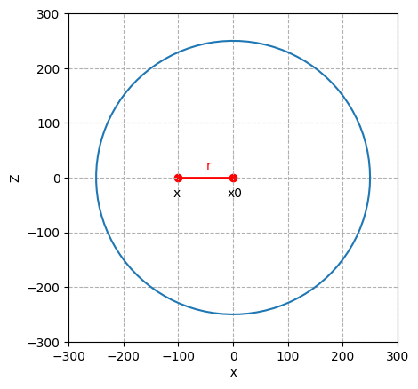
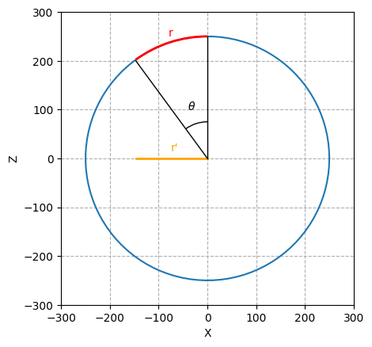
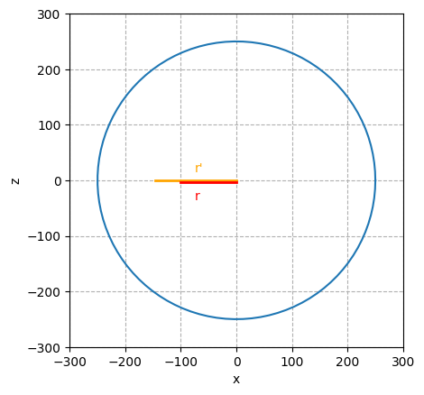

<!-- multilingual suffix: en-US, fr-FR -->
<!-- no suffix: fr-FR -->

<!-- [common] -->
# py_vasarely

[English](README.en-US.md),
[Français](README.md),

<!-- [ignore] -->
https://github.com/ryul1206/multilingual-markdown

<!-- [en-US] -->
Script to reproduce a silkscreen inspired by Vasarely

<!-- [fr-FR] -->
Script permettant de reproduire une sérigraphie inspirée de Vasarely

<!-- [common] -->
## Usage 

`python vasa.py`
`python sphere.py`

<!-- [common] -->
## Description

<!-- [en-US] -->
The color, shape and sphere are customizable.
<!-- [fr-FR] -->
La couleur, la forme et la sphère est personnalisable.

<!-- [en-US] -->
## Maths - Deformation following a sphere

We want to calculate the deformation of an image along a sphere. To do this, we represent the image in the form of a two-dimensional plane (x, y). In our example, we have an image of size 500x500 pixels, the pixel at the top left corresponds to the position 0,0 and the pixel at the bottom right corresponds to the position 499,499 in the x, y frame. This x, y plane will be deformed along a third axis, the z axis.

To better understand the math behind it, we can first reason in two dimensions by following one of the axes of the plane and the axis where we observe the plane. Point x corresponds to the position of the pixel in the X axis that we want to deform and point x0 the center of the sphere. The segment formed by its two points is called r.

<!-- [fr-FR] -->
## Maths - Déformation suivant une sphère

On souhaite calculer la déformation d'une image suivant une sphère. Pour cela, on représente l'image sous forme d'un plan en deux dimensions (x,y). Dans notre exemple, on a une image de taille 500x500 pixels, le pixel en haut à gauche correspond à la position 0,0 et le pixel en bas à droite correspond à la position 499,499 dans le repère x,y. Ce plan x,y sera déformé suivant un troisième axe, l'axe z.

Pour mieux comprendre les maths derrière, on peut raisonner d'abord en deux dimensions en suivant un des axe du plan et l'axe où on observe le plan. Le point x correspond à la position du pixel dans l'axe X que l'on souhaite déformer et le point x0 le centre de la sphère. Le segment formé par ses deux points est appelée r.

<!-- [common] -->

<!-- [en-US] -->
We deforms this segment r according to a circle and we calculate the segment projected on the axis x which we names r '.

<!-- [fr-FR] -->
On déforme ce segment r selon un cercle et on calcul le segment projeté sur l'axe x que l'on nomme r'. 

<!-- [common] -->
&theta; = (r / rayon) * PI/2

sin(&theta;) = r' / rayon

r' = rayon * sin(&theta;)

<!-- [en-US] -->
The ratio r '/ r is proportional to the deformation of x' / x

<!-- [fr-FR] -->
Le rapport r' / r est proportionnel à la déformation de x' / x 

<!-- [common] -->

(x' - x0) / (x - x0) = r' / r

x' - x0 = (r' / r) * (x - x0)

x' = (r' / r) * (x - x0) + x0

<!-- [en-US] -->
To go to 3 dimension, we compute the segment r along x and y using Pythagore.

<!-- [fr-FR] -->
Pour passer en 3 dimension, on calcul le segment r selon x et y en utilisant Pythagore.

<!-- [en-US] -->
Either r = ( x^2 + y^2 )^0.5

<!-- [fr-FR] -->
Soit r = ( x^2 + y^2 )^0.5
