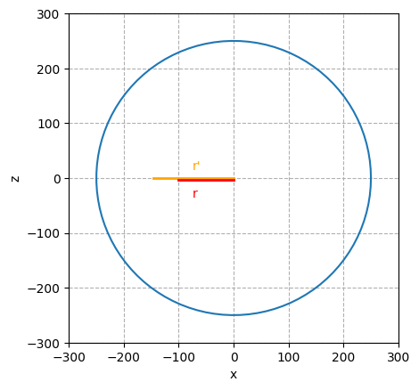

# py_vasarely

[English](README.en-US.md),
[Français](README.md),

Script to reproduce a silkscreen inspired by Vasarely

## Exemples

All steps are generated by the script.

<!--  -->

## Usage 

`python generate_vasa.py`

`python generate_grid1_convolution.py`

`python generate_sphere1_bilinear_interpol.py`

`python generate_sphere1_convolution.py`

## Description

The color, shape and sphere are customizable.
## Maths - Deformation following a sphere

We want to calculate the deformation of an image along a sphere. To do this, we represent the image in the form of a two-dimensional plane (x, y). In our example, we have an image of size 500x500 pixels, the pixel at the top left corresponds to the position 0,0 and the pixel at the bottom right corresponds to the position 499,499 in the x, y frame. This x, y plane will be deformed along a third axis, the z axis.

To better understand the math behind it, we can first reason in two dimensions by following one of the axes of the plane and the axis where we observe the plane. Point x corresponds to the position of the pixel in the X axis that we want to deform and point x0 the center of the sphere. The segment formed by its two points is called r.

We deforms this segment r according to a circle and we calculate the segment projected on the axis x which we names r '.

&theta; = (r / rayon) * PI/2

sin(&theta;) = r' / rayon

r' = rayon * sin(&theta;)

The ratio r '/ r is proportional to the deformation of x' / x

(x' - x0) / (x - x0) = r' / r

x' - x0 = (r' / r) * (x - x0)

x' = (r' / r) * (x - x0) + x0

To go to 3 dimension, we compute the segment r along x and y using Pythagore.

Either r = ( x^2 + y^2 )^0.5

