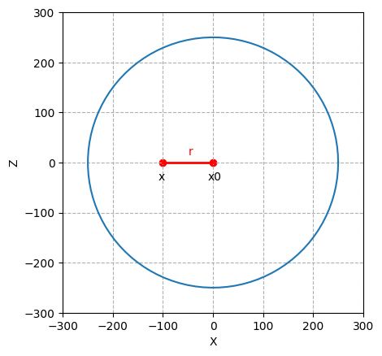
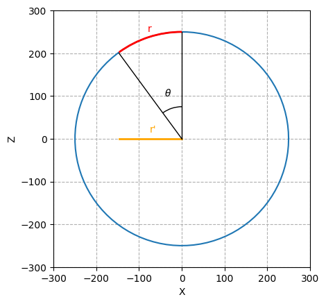

# py_vasarely

[English](README.en-US.md),
[Français](README.md),

Script permettant de reproduire une sérigraphie inspirée de Vasarely

## Usage 

`python vasa.py`
`python sphere.py`

## Description

La couleur, la forme et la sphère est personnalisable.

## Maths - Déformation suivant une sphère

On souhaite calculer la déformation d'une image suivant une sphère. Pour cela, on représente l'image sous forme d'un plan en deux dimensions (x,y). Dans notre exemple, on a une image de taille 500x500 pixels, le pixel en haut à gauche correspond à la position 0,0 et le pixel en bas à droite correspond à la position 499,499 dans le repère x,y. Ce plan x,y sera déformé suivant un troisième axe, l'axe z.

Pour mieux comprendre les maths derrière, on peut raisonner d'abord en deux dimensions en suivant un des axe du plan et l'axe où on observe le plan. Le point x correspond à la position du pixel dans l'axe X que l'on souhaite déformer et le point x0 le centre de la sphère. Le segment formé par ses deux points est appelée r.

On déforme ce segment r selon un cercle et on calcul le segment projeté sur l'axe x que l'on nomme r'. 

&theta; = (r / rayon) * PI/2

sin(&theta;) = r' / rayon

r' = rayon * sin(&theta;)

Le rapport r' / r est proportionnel à la déformation de x' / x 

(x' - x0) / (x - x0) = r' / r

x' - x0 = (r' / r) * (x - x0)

x' = (r' / r) * (x - x0) + x0

Pour passer en 3 dimension, on calcul le segment r selon x et y en utilisant Pythagore.

Soit r = ( x^2 + y^2 )^0.5
